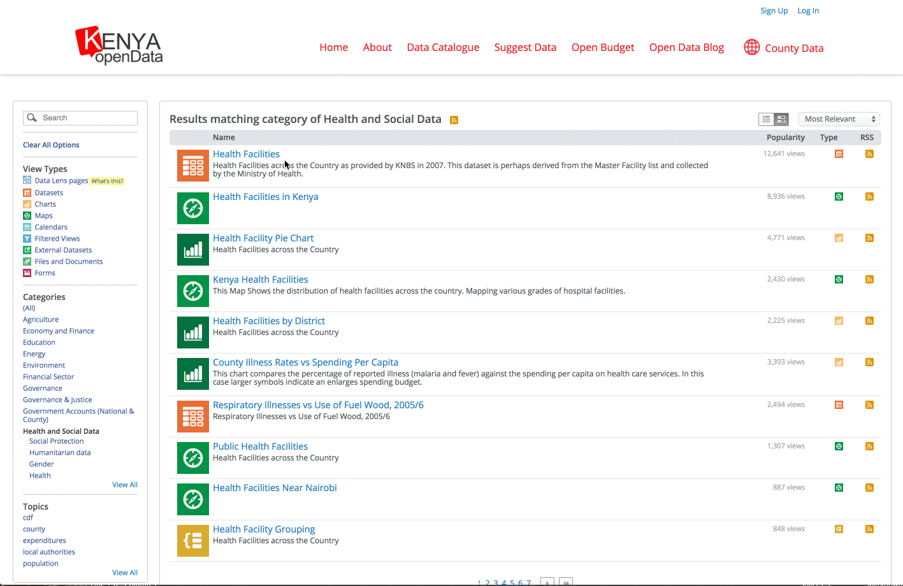

## 2015 Developers Workshop - Kenya
## Intro to Kenya Open Data APIs

===

<h1>Who the heck are you?</h1>

---

<h2>We build software to make data more useful to more people.</h2>

<!-- https://www.flickr.com/photos/hyku/2497370097 -->
--- 

<h2>We believe that greater access to  data makes this universe a better places to live</h2>

---

<h2>We make it easy for organizations to share their public data with developers</h2>

===

# So what is an API anyway?

---

  Application 
  Programming 
  Interface

---

# Common Language

A consistent way for two software systems to communicate.

---

# Stable Platform

A guarantee that the language will not change without notice.
    
---

# Contract

An API is a contract between a provider and a consumer.

===

# Why are APIs important?

---

## Open data is messy

<pre>
datavar 0 colorb_v
datavar 1 lum
datavar 2 absmag
datavar 3 appmag
datavar 4 texnum
datavar 5 distly
datavar 6 dcalc
datavar 7 plx
datavar 8 plxerr
datavar 9 vx
datavar 10 vy
datavar 11 vz
datavar 12 speed
datavar 13 hipnum
texturevar 4
texture -M 1 halo.sgi
    0.0000     0.0000     0.0000     0.650      0.89130      4.85    -26.72     1       0.00    0      0.000      0.00      0.000      0.000      0.000      0.000       0 # Sun
  -18.1007   143.5620  -242.6120     0.396     14.19036      1.85      9.10     1     920.90    1      3.540     39.27      0.000      0.000      0.000      0.000       1 # HIP1 HD224700 Gli  
    5.0098     9.8817   -44.2976     1.038      0.31704      5.97      9.27     1     148.86    1     21.900     14.16      0.000      0.000      0.000      0.000       2 # HIP2 HD224690 Gli  
 -123.2580   303.6977  -138.6362    -0.005    223.14508     -1.15      6.61     1    1160.14    1      2.810     22.42      0.000      0.000      0.000      0.000       3 # HIP3 HD224699 Gli  
  -50.4801   149.0259  -112.4977     1.822      6.96657      2.62      9.05     1     630.56    1      5.170     37.72     -6.247    -32.276      9.713     34.280       8 # HIP8 HD224709 Gli  
</pre>

from research.amnh.org
    
---
    
## A downloaded dataset is a stale dataset

---

## Developers don’t want to manage custom datastores

---

## You want apps to be easily portable

===

# The Socrata Open Data APIs

---

## Finding Data 
 
### [www.opendata.go.ke](https://www.opendata.go.ke/)
 
### [http://www.opendatanetwork.com/](http://www.opendatanetwork.com/)

---

### In the Data Catalog

---

## API Endpoints

 
<code style='font-size:120%;'>https://$domain/resource/$identifier.$ext</code>

 

<em>Where:</em>

- <code>$domain</code> is the publisher's domain (ex: <code>opendata.kenya.go.ke</code>)
- <code>$identifier</code> is a dataset's unique ID (ex: <code>89zb-g69r</code>)
- <code>$ext</code> is <code>json</code>, <code>csv</code>, <code>xml</code>, or <code>rdf</code>

---

## Example: Health Facilities

<a target='blank' style='color:#FFF !important' href='https://data.nasa.gov/resource/gh4g-9sfh.json'><code style=''>https://opendata.go.ke/resource/89zb-g69r.json</code></a>

<pre>
  <code data-trim contenteditable class="javascript">
[
  {
    "hmis": "251",
    "f_name": "KIAMBU DISTRICT HOSPITAL",
    "location": "KIAMBAA S/AREA",
    "constituency": "GATUNDU NORTH",
    "agency": "MOH",
    "facility_type": "1",
    "sub_location": "TOWNSHIP(KIAMBAA)",
    "division": "KIAMBAA",
    "geolocation": {
    "needs_recoding": false,
    "longitude": "36.82993",
    "latitude": "-1.16938"
    },
    "facility_type_name": "Hospital Moh and Mission Districts, sub-districts",
    "county": "KIAMBU",
    "facility_number": "29",
    "province": "CENTRAL",
    "district": "KIAMBU",
    "spatial_reference_method": "GPS"
  },
  {
    "hmis": "252",
    "f_name": "KIJABE HOSPITAL",
    "location": "KIJABE",
    "constituency": "GATUNDU NORTH",
    "agency": "MISS",
    "facility_type": "1",
    "sub_location": "KIJABE",
    "division": "LARI",
    "geolocation": {
    "needs_recoding": false,
    "longitude": "36.59431",
    "latitude": "-0.94349"
    },
    "facility_type_name": "Hospital Moh and Mission Districts, sub-districts",
    "county": "KIAMBU",
    "facility_number": "36",
    "province": "CENTRAL",
    "district": "KIAMBU",
    "spatial_reference_method": "GPS"
  }, ...                      // and so on
]
  </code>
</pre>

---

## Simple Filters

<a target='blank' style='color:#FFF !important' href='https://data.nasa.gov/resource/gh4g-9sfh.json?name=Independence'><code style=''>https://opendata.go.ke/resource/89zb-g69r.json
 ?name=AGA KHAN HOSPITAL</code></a>

<pre><code data-trim contenteditable class="javascript">
[
  {
    "hmis": "1",
    "f_name": "AGA KHAN HOSPITAL",
    "location": "HIGHRIDGE",
    "constituency": "KAMUKUNJI",
    "agency": "PRIV",
    "facility_type": "5",
    "sub_location": "HIGHRIDGE",
    "division": "WESTLANDS",
    "geolocation": {
    "needs_recoding": false,
    "longitude": "36.822479",
    "latitude": "-1.259263"
    },
    "facility_type_name": "Private Hospital",
    "county": "NAIROBI",
    "facility_number": "298",
    "province": "NAIROBI",
    "district": "NAIROBI",
    "spatial_reference_method": "WAYUMBA"
  }
  ...
]
</code></pre>

---

## SoQL Queries

<code>http://opendata.go.ke/resource/u77w-ifgt.json?$where=no_of_households_with_electricty &lt; 1000 AND no_of_househols_with_fuel_wood &gt; 500
</code>

<small style="padding-top: 5em">For more details see <a href="http://dev.socrata.com">dev.socrata.com</a></small>

---

## Aggregating Data

<a target='blank' style='color:#FFF !important' href="https://opendata.go.ke/resource/q2r9-tvwf.json?$select=year_text,sum(no_of_visitors_to_kenya)&$where=arrival_or_departure='arrivals'&$group=year_text&$order=sum_no_of_visitors_to_kenya+desc"><code style=''>https://data.nasa.gov/resource/gh4g-9sfh.json
 ?$select=year_text,sum(no_of_visitors_to_kenya)&$where=arrival_or_departure='arrivals'&$group=year_text &$order=sum_no_visitors_to_kenya DESC</code></a>

<pre><code data-trim contenteditable class="javascript">
  [
    {
    "year_text": "2005",
    "sum_no_of_visitors_to_kenya": "5253300"
    },
    {
    "year_text": "2006",
    "sum_no_of_visitors_to_kenya": "4838800"
    },
    {
    "year_text": "2007",
    "sum_no_of_visitors_to_kenya": "2835200"
    },
    {
    "year_text": "2009*",
    "sum_no_of_visitors_to_kenya": "2022700"
    },
    {
    "year_text": "2011",
    "sum_no_of_visitors_to_kenya": "1822700"
    }, 
    ...
  ]
</code></pre>

---

## Geospatial Queries
  <a target='blank' style='color:#FFF !important' href='https://opendata.go.ke/resource/89zb-g69r.json?$where=within_circle(geolocation, 0.07, 40.32, 10000)'><code style=''>https://opendata.go.ke/resource/89zb-g69r.json
   ?$where=within_circle(geolocation, 0.07, 40.32, 10000)</code></a>

  <pre><code data-trim contenteditable class="javascript">
  [
    {
      "hmis": "2512",
      "f_name": "DAGAHALEY HOSPITAL",
      "location": "DAGAHALEY",
      "constituency": "BALAMBALA",
      "agency": "MISS",
      "facility_type": "1",
      "sub_location": "DAGAHALEY(GARISSA)",
      "division": "DADAAB",
      "geolocation": {
        "needs_recoding": false,
        "longitude": "40.342856",
        "latitude": "0.150541"
      },
      "facility_type_name": "Hospital Moh and Mission Districts, sub-districts",
      "county": "GARISSA",
      "facility_number": "8",
      "province": "N. EASTERN",
      "district": "GARISSA",
      "spatial_reference_method": "ILRI MKT CENTRES"
    },
    ...
  ]
  </code></pre>

---
## Paging Through Data

<a target='blank' style='color:#FFF !important' href='https://opendata.go.ke/resource/s63d-ajgd.json?$limit=50&$offset=100'><code style=''>https://data.nasa.gov/resource/s63d-ajgd.json
 ?$limit=50&$offset=100</code></a>

---

## Application Tokens

1. Register at [https://opendata.go.ke/profile/app_tokens](https://opendata.go.ke/profile/app_tokens)
2. Include as:
  - <code>X-App-Token: $token</code> HTTP Header or ... 
  - The <code>$$app_token=$token</code> URL parameter
3. Profit!!! (from more API requests)

===

# Help!

---

## Developer Portal

# [dev.socrata.com](http://dev.socrata.com)

Community powered! Learn how to <a href="http://dev.socrata.com/contributing.html">contribute</a>.

--- 

## Getting Help

- In person
- IRC: [chat.freenode.net/#socrata-soda](irc://chat.freenode.net/#socrata-soda)
- Stack Overflow: [soda](http://stackoverflow.com/questions/tagged/soda) or [socrata](http://stackoverflow.com/questions/tagged/socrata)

---

## Libraries &amp; SDKs

### [dev.socrata.com/libraries/](http://dev.socrata.com/libraries/)

<a href="http://socrata.github.io/soda-ruby/">Ruby</a>, <a href="https://github.com/socrata/soda-scala">Scala</a>, <a href="http://socrata.github.io/soda-java/">Java</a>, <a href="https://github.com/socrata/soda-ios-sdk">ObjectiveC</a>, <a href="https://github.com/Chicago/RSocrata">R</a>, <a href="https://github.com/socrata/soda-swift">Swift</a>, etc.

===

# Thanks!
