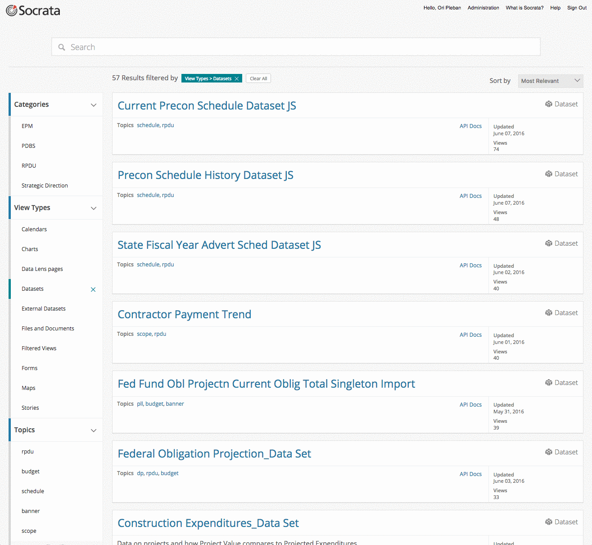

## Developers' Workshop
## Socrata OpenData APIs

### Ori Pleban
### Web Developer, Socrata
### ori.pleban@socrata.com

===

<h1>Who the heck are you?</h1>

---

<h2>We build software to make data more useful to more people.</h2>

<!-- https://www.flickr.com/photos/hyku/2497370097 -->
---

<h2>We believe that greater access to  data makes this universe a better places to live</h2>

---

<h2>We make it easy for organizations to share their public data with developers</h2>

===

# So what is an API anyway?

---

  Application 
  Programming 
  Interface

---

# Common Language

A consistent way for two software systems to communicate.

---

# Stable Platform

A guarantee that the language will not change without notice.

---

# Contract

An API is a contract between a provider and a consumer.

===

# Why are APIs important?

---

## Open data is messy

<pre>
datavar 0 colorb_v
datavar 1 lum
datavar 2 absmag
datavar 3 appmag
datavar 4 texnum
datavar 5 distly
datavar 6 dcalc
datavar 7 plx
datavar 8 plxerr
datavar 9 vx
datavar 10 vy
datavar 11 vz
datavar 12 speed
datavar 13 hipnum
texturevar 4
texture -M 1 halo.sgi
    0.0000     0.0000     0.0000     0.650      0.89130      4.85    -26.72     1       0.00    0      0.000      0.00      0.000      0.000      0.000      0.000       0 # Sun
  -18.1007   143.5620  -242.6120     0.396     14.19036      1.85      9.10     1     920.90    1      3.540     39.27      0.000      0.000      0.000      0.000       1 # HIP1 HD224700 Gli
    5.0098     9.8817   -44.2976     1.038      0.31704      5.97      9.27     1     148.86    1     21.900     14.16      0.000      0.000      0.000      0.000       2 # HIP2 HD224690 Gli
 -123.2580   303.6977  -138.6362    -0.005    223.14508     -1.15      6.61     1    1160.14    1      2.810     22.42      0.000      0.000      0.000      0.000       3 # HIP3 HD224699 Gli
  -50.4801   149.0259  -112.4977     1.822      6.96657      2.62      9.05     1     630.56    1      5.170     37.72     -6.247    -32.276      9.713     34.280       8 # HIP8 HD224709 Gli
</pre>

from research.amnh.org

---

## A downloaded dataset is a stale dataset

---

## Developers don’t want to manage custom datastores

---

## You want apps to be easily portable

===

# The Socrata Open Data APIs

---

## Finding Data
 
### [udot.data.socrata.com](https://udot.data.socrata.com/)
 
### [www.opendatanetwork.com](https://www.opendatanetwork.com/)

---

### In the Data Catalog

---

## API Endpoints

 
<code style='font-size:120%;'>https://$domain/resource/$identifier.$ext</code>

 

<em>Where:</em>

- <code>$domain</code> is the publisher's domain (ex: <code>udot.data.socrata.com</code>)
- <code>$identifier</code> is a dataset's unique ID (ex: <code>efb7-dcwk</code>)
- <code>$ext</code> is <code>json</code>, <code>csv</code>, <code>xml</code>, or <code>rdf</code>

---

## Example: Construction Expenditures Data Set

<a target='blank' style='color:#FFF !important' href='https://udot.data.socrata.com/resource/efb7-dcwk.json'><code style=''>https://udot.data.socrata.com/resource/efb7-dcwk.json</code></a>

<pre>
  <code data-trim contenteditable class="javascript">
[
  {
    "proj_xref_no": "5087.00",
    "pin_desc": "1300 SOUTH; 500 WEST TO 700 WEST",
    "local_gov_proj_flag": "Y",
    "project_number": "F-LC35(184)",
    "projected_expenditures": "10342889.45",
    "project_manager": "Peter S. Tang",
    "re": "Deryl Mayhew",
    "execution": ">Projected Exp.",
    "pdbs_proj_id": "3934.00",
    "pin": "6621",
    "region_cd": "2",
    "pin_status": "Const_Complete",
    "award_dt": "2014-09-25T00:00:00",
    "project_value": "10682898.00"
  },
  {
    "proj_xref_no": "5290.00",
    "pin_desc": "SR-92, Lehi to Highland, Roadway Widen",
    "local_gov_proj_flag": "N",
    "project_number": "F-0092(12)1",
    "projected_expenditures": "151047066.50",
    "project_manager": "Daniel Avila",
    "re": "Jose Rodriguez 801-602-7159",
    "execution": ">Projected Exp.",
    "pdbs_proj_id": "2767.00",
    "pin": "6690",
    "region_cd": "3",
    "pin_status": "Const_Complete",
    "award_dt": "2009-04-16T00:00:00",
    "project_value": "175436492.88"
  },
  {
    "proj_xref_no": "4626.00",
    "pin_desc": "I-80; Castle Rock to Wyoming State Line",
    "local_gov_proj_flag": "N",
    "project_number": "F-I80-4(159)186",
    "projected_expenditures": "8504938.00",
    "project_manager": "Daniel S. Young Udot",
    "re": "Bryan Chamberlain",
    "execution": ">Projected Exp.",
    "pdbs_proj_id": "4694.00",
    "pin": "6997",
    "region_cd": "2",
    "pin_status": "Awarded",
    "award_dt": "2016-04-25T00:00:00",
    "project_value": "10500000.00"
  }, ...                      // and so on
]
  </code>
</pre>

---

## Simple Filters

<a target='blank' style='color:#FFF !important' href='https://udot.data.socrata.com/resource/efb7-dcwk.json?project_manager=Brett Slater'><code style=''>https://udot.data.socrata.com/resource/efb7-dcwk.json
 ?project_manager=Brett Slater</code></a>

<pre><code data-trim contenteditable class="javascript">
[
  {
    "proj_xref_no": "8362.00",
    "pin_desc": "US-89; SR-203 Intersection Improvements",
    "local_gov_proj_flag": "N",
    "project_number": "F-0089(326)408",
    "projected_expenditures": "6328247.79",
    "project_manager": "Brett Slater",
    "re": "Chad Pollard",
    "execution": ">Projected Exp.",
    "pdbs_proj_id": "4453.00",
    "pin": "10708",
    "region_cd": "1",
    "pin_status": "Under_Const",
    "award_dt": "2015-04-09T00:00:00",
    "project_value": "6447993.41"
  },
  {
    "proj_xref_no": "9774.00",
    "pin_desc": "SR-232; I-15 to SR-193",
    "local_gov_proj_flag": "N",
    "project_number": "F-0232(9)0",
    "projected_expenditures": "5754269.63",
    "project_manager": "Brett Slater",
    "re": "Thomas H. Roylance",
    "execution": ">Projected Exp.",
    "pdbs_proj_id": "4646.00",
    "pin": "12279",
    "region_cd": "1",
    "pin_status": "Awarded",
    "award_dt": "2015-11-04T00:00:00",
    "project_value": "6319935.00"
  },
  {
    "proj_xref_no": "9779.00",
    "pin_desc": "SR-109; SR-126 to US-89",
    "local_gov_proj_flag": "N",
    "project_number": "F-0109(4)0",
    "projected_expenditures": "2194334.15",
    "project_manager": "Brett Slater",
    "re": "Deryl Mayhew",
    "execution": ">Projected Exp.",
    "pdbs_proj_id": "4787.00",
    "pin": "12284",
    "region_cd": "1",
    "pin_status": "Awarded",
    "award_dt": "2016-05-18T00:00:00",
    "project_value": "2313354.63"
  },
  {
    "proj_xref_no": "9472.00",
    "pin_desc": "SR-232 & I-15; Hill Field Rd. Intrchg. Mod.",
    "local_gov_proj_flag": "N",
    "project_number": "S-0232(8)0",
    "projected_expenditures": "35591698.11",
    "project_manager": "Brett Slater",
    "re": "Deryl Mayhew",
    "execution": ">Projected Exp.",
    "pdbs_proj_id": "4102.00",
    "pin": "11946",
    "region_cd": "1",
    "pin_status": "Under_Const",
    "award_dt": "2015-04-01T00:00:00",
    "project_value": "38638529.76"
  } ... // and so on
]
</code></pre>

---

## SoQL Queries

<a href="https://udot.data.socrata.com/resource/efb7-dcwk.json?$WHERE=pin_status = 'Awarded' AND project_value > 10000000"><code>http://udot.data.socrata.com/resource/efb7-dcwk.json?$WHERE=pin_status = 'AWARDED' AND project_value &gt; 10000000</code></a>

<pre><code data-trim contenteditable class="javascript">
  [
    {
      "award_dt": "2016-04-25T00:00:00.000",
      "execution": ">Projected Exp.",
      "local_gov_proj_flag": "N",
      "pdbs_proj_id": "4694.00",
      "pin": "6997",
      "pin_desc": "I-80; Castle Rock to Wyoming State Line",
      "pin_status": "Awarded",
      "proj_xref_no": "4626.00",
      "project_manager": "Daniel S. Young Udot",
      "project_number": "F-I80-4(159)186",
      "project_value": "10500000.00",
      "projected_expenditures": "8504938.00",
      "re": "Bryan Chamberlain",
      "region_cd": "2"
    },
    {
      "award_dt": "2016-04-20T00:00:00.000",
      "execution": ">Projected Exp.",
      "local_gov_proj_flag": "N",
      "pdbs_proj_id": "4700.00",
      "pin": "10792",
      "pin_desc": "I-15; MP 8-10 Aux Lanes and Mall Drive Underpass",
      "pin_status": "Awarded",
      "proj_xref_no": "8436.00",
      "project_manager": "Kim Manwill",
      "project_number": "S-I15-1(105)9",
      "project_value": "27198000.00",
      "projected_expenditures": "19899888.50",
      "re": "David Ray Bentley",
      "region_cd": "4"
    },
    {
      "award_dt": "2015-11-09T00:00:00.000",
      "execution": ">Projected Exp.",
      "local_gov_proj_flag": "N",
      "pdbs_proj_id": "4599.00",
      "pin": "12278",
      "pin_desc": " I-15; I-84 to SR-134",
      "pin_status": "Awarded",
      "proj_xref_no": "9773.00",
      "project_manager": "Michael W. Romero",
      "project_number": "F-I15-8(155)344",
      "project_value": "14131168.00",
      "projected_expenditures": "12263730.65",
      "re": "Jace Mecham",
      "region_cd": "1"
    },
    {
      "award_dt": "2016-02-18T00:00:00.000",
      "execution": ">Projected Exp.",
      "local_gov_proj_flag": "N",
      "pdbs_proj_id": "4654.00",
      "pin": "12518",
      "pin_desc": "SR-199; Dugway to SR-36",
      "pin_status": "Awarded",
      "proj_xref_no": "10005.00",
      "project_manager": "Steven J. Quinn",
      "project_number": "F-0199(6)0",
      "project_value": "11670067.00",
      "projected_expenditures": "10780066.45",
      "re": "Rodney J. Ruby",
      "region_cd": "2"
    },
    {
      "award_dt": "2016-03-14T00:00:00.000",
      "execution": ">Projected Exp.",
      "local_gov_proj_flag": "N",
      "pdbs_proj_id": "4590",
      "pin": "11415",
      "pin_desc": "US-189; State Park to Rock Cut Passing Lanes",
      "pin_status": "Awarded",
      "proj_xref_no": "9014",
      "project_manager": "Larry Montoya",
      "project_number": "F-0189(53)20",
      "project_value": "12648131",
      "projected_expenditures": "11633268.99",
      "re": "Boyd Humpherys",
      "region_cd": "3"
    }
  ]
</pre></code>
<small style="padding-top: 5em">For more details see <a href="http://dev.socrata.com">dev.socrata.com</a></small>

---

## SoQL Clauses

<table class="table table-striped table-hover">
  <thead>
    <tr>
      <th>Parameter</th>
      <th>Description</th>
      <th>Default</th>
      <th>In <code class="highlighter-rouge">$query</code></th>
    </tr>
  </thead>
  <tbody>
    <tr>
      <td><a href="/docs/queries/select.html"><code class="highlighter-rouge">$select</code></a></td>
      <td>The set of columns to be returned, similar to a <code class="highlighter-rouge">SELECT</code> in SQL</td>
      <td>All columns, equivalent to <code class="highlighter-rouge">$select=*</code></td>
      <td><code class="highlighter-rouge">SELECT</code></td>
    </tr>
    <tr>
      <td><a href="/docs/queries/where.html"><code class="highlighter-rouge">$where</code></a></td>
      <td>Filters the rows to be returned, similar to <code class="highlighter-rouge">WHERE</code></td>
      <td>No filter</td>
      <td><code class="highlighter-rouge">WHERE</code></td>
    </tr>
    <tr>
      <td><a href="/docs/queries/order.html"><code class="highlighter-rouge">$order</code></a></td>
      <td>Column to order results on, similar to ORDER BY in SQL</td>
      <td>Unspecified order</td>
      <td><code class="highlighter-rouge">ORDER BY</code></td>
    </tr>
    <tr>
      <td><a href="/docs/queries/group.html"><code class="highlighter-rouge">$group</code></a></td>
      <td>Column to group results on, similar to GROUP BY in SQL</td>
      <td>No grouping</td>
      <td><code class="highlighter-rouge">GROUP BY</code></td>
    </tr>
    <tr>
      <td><a href="/docs/queries/having.html"><code class="highlighter-rouge">$having</code></a></td>
      <td>Filters the rows that result from an aggregation, similar to <code class="highlighter-rouge">HAVING</code></td>
      <td>No filter</td>
      <td><code class="highlighter-rouge">HAVING</code></td>
    </tr>
    <tr>
      <td><a href="/docs/queries/limit.html"><code class="highlighter-rouge">$limit</code></a></td>
      <td>Maximum number of results to return</td>
      <td>1000 (2.0 endpoints: maximum of 50,000; 2.1: unlimited <a href="/docs/endpoints.html">»</a>)</td>
      <td><code class="highlighter-rouge">LIMIT</code></td>
    </tr>
    <tr>
      <td><a href="/docs/queries/offset.html"><code class="highlighter-rouge">$offset</code></a></td>
      <td>Offset count into the results to start at, used for paging</td>
      <td>0</td>
      <td><code class="highlighter-rouge">OFFSET</code></td>
    </tr>
    <tr>
      <td><a href="/docs/queries/q.html"><code class="highlighter-rouge">$q</code></a></td>
      <td>Performs a full text search for a value.</td>
      <td>No search</td>
      <td><code class="highlighter-rouge">N/A</code></td>
    </tr>
    <tr>
      <td><a href="/docs/queries/query.html"><code class="highlighter-rouge">$query</code></a></td>
      <td>A full SoQL query string, all as one parameter</td>
      <td>N/A</td>
      <td><code class="highlighter-rouge">N/A</code></td>
    </tr>
  </tbody>
</table>

---

## Aggregating Data

<a target='blank' style='color:#FFF !important' href="https://udot.data.socrata.com/resource/efb7-dcwk.json?$select=project_manager,sum(project_value) AS sum_of_project_values&$group=project_manager&$order=sum_of_project_values+desc"><code style=''>https://udot.data.socrata.com/resource/efb7-dcwk.json?$select=project_manager,sum(project_value) AS sum_of_project_value&$group=project_manager&$order=sum_of_project_value DESC</code></a>

<pre><code data-trim contenteditable class="javascript">
  [
    {
    "project_manager": "Tim Rose",
    "sum_of_project_values": "221262753.09"
    },
    {
    "project_manager": "Daniel Avila",
    "sum_of_project_values": "175436492.88"
    },
    {
    "project_manager": "Nathan Peterson",
    "sum_of_project_values": "148802896.01"
    },
    {
    "project_manager": "Oanh Amber Le-Spradlin",
    "sum_of_project_values": "120116644.87"
    },
    {
    "project_manager": "Brett Slater",
    "sum_of_project_values": "80340013.01"
    },
    {
    "project_manager": "John Montoya",
    "sum_of_project_values": "71326213.12"
    },
    {
    "project_manager": "Rod Terry",
    "sum_of_project_values": "59138714"
    }, ... // and so on
  ]
</code></pre>

---

## Geospatial Queries
  <a target='blank' style='color:#FFF !important' href='https://udot.data.socrata.com/resource/89zb-g69r.json?$where=within_circle(geolocation, 0.07, 40.32, 10000)'><code style=''>https://udot.data.socrata.com/resource/89zb-g69r.json
   ?$where=within_circle(geolocation, 0.07, 40.32, 10000)</code></a>

  <pre><code data-trim contenteditable class="javascript">
  [
    {
      "hmis": "2512",
      "f_name": "DAGAHALEY HOSPITAL",
      "location": "DAGAHALEY",
      "constituency": "BALAMBALA",
      "agency": "MISS",
      "facility_type": "1",
      "sub_location": "DAGAHALEY(GARISSA)",
      "division": "DADAAB",
      "geolocation": {
        "needs_recoding": false,
        "longitude": "40.342856",
        "latitude": "0.150541"
      },
      "facility_type_name": "Hospital Moh and Mission Districts, sub-districts",
      "county": "GARISSA",
      "facility_number": "8",
      "province": "N. EASTERN",
      "district": "GARISSA",
      "spatial_reference_method": "ILRI MKT CENTRES"
    },
    ...
  ]
  </code></pre>

---
## Paging Through Data

<a target='_blank' style='color:#FFF !important' href='https://udot.data.socrata.com/resource/s63d-ajgd.json?$limit=50&$offset=100'><code style=''>https://udot.data.socrata.com/resource/s63d-ajgd.json
 ?$limit=50&$offset=100</code></a>

---

## SoQL Function Listing

<a target='_blank' style='color:#FFF !important' href='https://dev.socrata.com/docs/functions/'>

---

## Application Tokens

1. Register at [https://udot.data.socrata.com/profile/app_tokens](https://udot.data.socrata.com/profile/app_tokens)
2. Include as:
  - <code>X-App-Token: $token</code> HTTP Header or ...
  - The <code>$$app_token=$token</code> URL parameter
3. Profit!!! (from more API requests)

===

# Help!

---

## Developer Portal

# [dev.socrata.com](http://dev.socrata.com)

Community powered! Learn how to <a href="http://dev.socrata.com/contributing.html">contribute</a>.

---

## Getting Help

- In person
- IRC: [chat.freenode.net/#socrata-soda](irc://chat.freenode.net/#socrata-soda)
- Stack Overflow: [soda](http://stackoverflow.com/questions/tagged/soda) or [socrata](http://stackoverflow.com/questions/tagged/socrata)

---

## Libraries &amp; SDKs

### [dev.socrata.com/libraries/](http://dev.socrata.com/libraries/)

<a href="http://socrata.github.io/soda-ruby/">Ruby</a>, <a href="https://github.com/socrata/soda-scala">Scala</a>, <a href="http://socrata.github.io/soda-java/">Java</a>, <a href="https://github.com/socrata/soda-ios-sdk">ObjectiveC</a>, <a href="https://github.com/Chicago/RSocrata">R</a>, <a href="https://github.com/socrata/soda-swift">Swift</a>, etc.

===

# Thanks!
