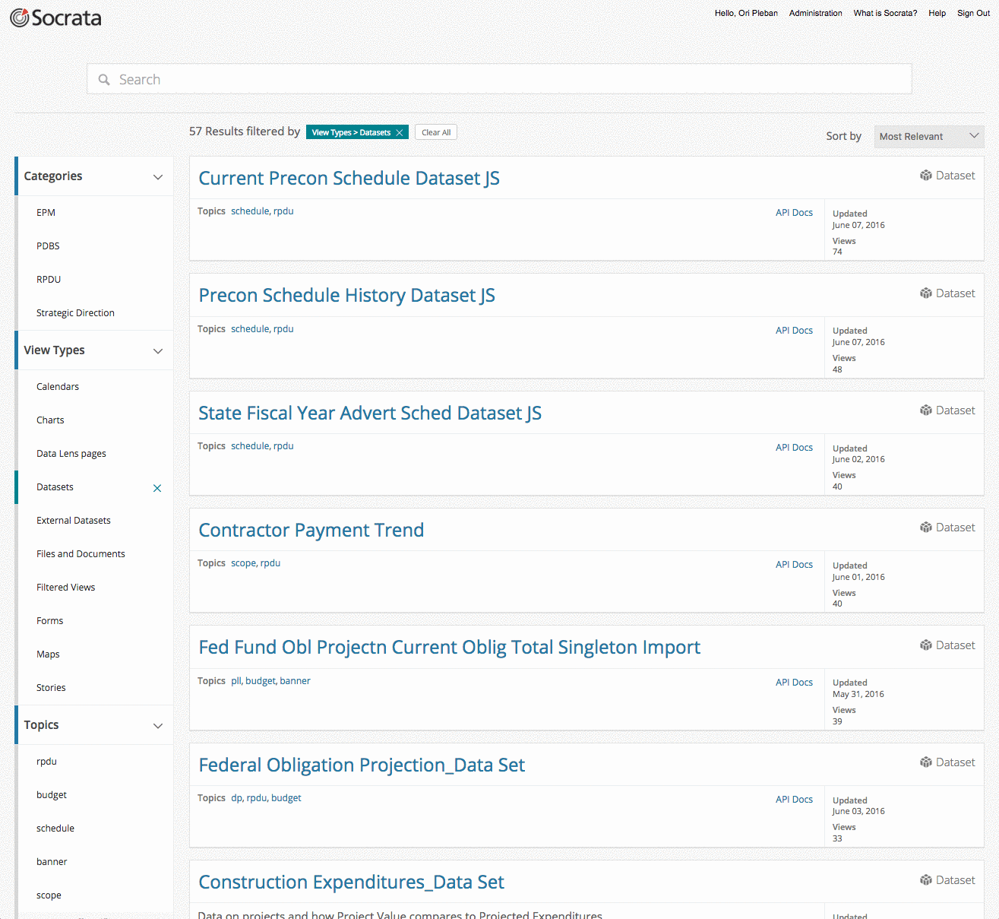

## Delaware Developers' Workshop
## Socrata OpenData APIs

### Ori Pleban
### Web Developer, Socrata
### ori.pleban@socrata.com

===

<h1>Who the heck are you?</h1>

---

<h2>We build software to make data more useful to more people.</h2>

<!-- https://www.flickr.com/photos/hyku/2497370097 -->
---

<h2>We believe that greater access to  data makes this universe a better places to live</h2>

---

<h2>We make it easy for organizations to share their public data with developers</h2>

===

# So what is an API anyway?

---

  Application 
  Programming 
  Interface

---

# Common Language

A consistent way for two software systems to communicate.

---

# Stable Platform

A guarantee that the language will not change without notice.

---

# Contract

An API is a contract between a provider and a consumer.

===

# Why are APIs important?

---

## Open data is messy

<pre>
datavar 0 colorb_v
datavar 1 lum
datavar 2 absmag
datavar 3 appmag
datavar 4 texnum
datavar 5 distly
datavar 6 dcalc
datavar 7 plx
datavar 8 plxerr
datavar 9 vx
datavar 10 vy
datavar 11 vz
datavar 12 speed
datavar 13 hipnum
texturevar 4
texture -M 1 halo.sgi
    0.0000     0.0000     0.0000     0.650      0.89130      4.85    -26.72     1       0.00    0      0.000      0.00      0.000      0.000      0.000      0.000       0 # Sun
  -18.1007   143.5620  -242.6120     0.396     14.19036      1.85      9.10     1     920.90    1      3.540     39.27      0.000      0.000      0.000      0.000       1 # HIP1 HD224700 Gli
    5.0098     9.8817   -44.2976     1.038      0.31704      5.97      9.27     1     148.86    1     21.900     14.16      0.000      0.000      0.000      0.000       2 # HIP2 HD224690 Gli
 -123.2580   303.6977  -138.6362    -0.005    223.14508     -1.15      6.61     1    1160.14    1      2.810     22.42      0.000      0.000      0.000      0.000       3 # HIP3 HD224699 Gli
  -50.4801   149.0259  -112.4977     1.822      6.96657      2.62      9.05     1     630.56    1      5.170     37.72     -6.247    -32.276      9.713     34.280       8 # HIP8 HD224709 Gli
</pre>

from research.amnh.org

---

## A downloaded dataset is a stale dataset

---

## Developers don’t want to manage custom datastores

---

## You want apps to be easily portable

===

# The Socrata Open Data APIs

---

## Finding Data
 
### [udot.data.socrata.com](https://udot.data.socrata.com/)
 
### [www.opendatanetwork.com](https://www.opendatanetwork.com/)

---

### In the Data Catalog

---

## API Endpoints

 
<code style='font-size:120%;'>https://$domain/resource/$identifier.$ext</code>

 

<em>Where:</em>

- <code>$domain</code> is the publisher's domain (ex: <code>udot.data.socrata.com</code>)
- <code>$identifier</code> is a dataset's unique ID (ex: <code>efb7-dcwk</code>)
- <code>$ext</code> is <code>json</code>, <code>csv</code>, <code>xml</code>, or <code>rdf</code>

---

## Example: Construction Expenditures Data Set

<a target='blank' style='color:#FFF !important' href='https://data.delaware.gov/resource/phiq-bthj.json'><code style=''>https://data.delaware.gov/resource/phiq-bthj.json</code></a>

<pre>
  <code data-trim contenteditable class="javascript">
[
  {
    "cat_descr": "Government Services-Not Elsewhere Classified",
    "dept_name": "SVS FR CHILDREN YOUTH FAMILIES",
    "div_name": "InterventionTreatment",
    "fiscal_period": "7",
    "fiscal_year": "2017",
    "merchandise_amt": "20",
    "merchant": "DELAWARE DMV DOVER",
    "trans_dt": "2017-01-19T00:00:00.000"
  },
  {
    "cat_descr": "Book Stores",
    "dept_name": "SVS FR CHILDREN YOUTH FAMILIES",
    "div_name": "Education Services",
    "fiscal_period": "7",
    "fiscal_year": "2017",
    "merchandise_amt": "169.89",
    "merchant": "AMAZON MKTPLACE PMTS",
    "trans_dt": "2017-01-19T00:00:00.000"
  },
  {
    "cat_descr": "Telecom Incl Prepaid-Recurring Phone Svcs",
    "dept_name": "DEPT OF NATRL RES AND ENV CONT",
    "div_name": "Waste and Hazardous Substances",
    "fiscal_period": "7",
    "fiscal_year": "2017",
    "merchandise_amt": "418.58",
    "merchant": "VZWRLSS*MY VZ VB P",
    "trans_dt": "2017-01-18T00:00:00.000"
  },
  {
    "cat_descr": "Fast Food Restaurants",
    "dept_name": "DEPT OF LABOR",
    "div_name": "OSHABLS",
    "fiscal_period": "7",
    "fiscal_year": "2017",
    "merchandise_amt": "6.49",
    "merchant": "MCDONALD'S F4777",
    "trans_dt": "2017-01-12T00:00:00.000"
  }, ... // and so on
]
  </code>
</pre>

---

## Simple Filters

<a target='blank' style='color:#FFF !important' href='https://data.delaware.gov/resource/phiq-bthj.json?merchant=DELAWARE DMV DOVER'><code style=''>https://data.delaware.gov/resource/phiq-bthj.json
 ?merchant=DELAWARE DMV DOVER</code></a>

<pre><code data-trim contenteditable class="javascript">
[
  {
    "cat_descr": "Government Services-Not Elsewhere Classified",
    "dept_name": "SVS FR CHILDREN YOUTH FAMILIES",
    "div_name": "InterventionTreatment",
    "fiscal_period": "7",
    "fiscal_year": "2017",
    "merchandise_amt": "20",
    "merchant": "DELAWARE DMV DOVER",
      "trans_dt": "2017-01-19T00:00:00.000"
  },
  {
    "cat_descr": "Government Services-Not Elsewhere Classified",
    "dept_name": "SVS FR CHILDREN YOUTH FAMILIES",
    "div_name": "InterventionTreatment",
    "fiscal_period": "7",
    "fiscal_year": "2017",
    "merchandise_amt": "20",
    "merchant": "DELAWARE DMV DOVER",
    "trans_dt": "2017-01-14T00:00:00.000"
  },
  {
    "cat_descr": "Government Services-Not Elsewhere Classified",
    "dept_name": "SVS FR CHILDREN YOUTH FAMILIES",
    "div_name": "InterventionTreatment",
    "fiscal_period": "7",
    "fiscal_year": "2017",
    "merchandise_amt": "20",
    "merchant": "DELAWARE DMV DOVER",
    "trans_dt": "2017-01-14T00:00:00.000"
  },
  {
    "cat_descr": "Government Services-Not Elsewhere Classified",
    "dept_name": "SVS FR CHILDREN YOUTH FAMILIES",
    "div_name": "InterventionTreatment",
    "fiscal_period": "7",
    "fiscal_year": "2017",
    "merchandise_amt": "20",
    "merchant": "DELAWARE DMV DOVER",
    "trans_dt": "2017-01-21T00:00:00.000"
  },
  {
    "cat_descr": "Government Services-Not Elsewhere Classified",
    "dept_name": "DEPT OF HEALTH AND SOCIAL SV",
    "div_name": "AdministrationCommunity Svcs",
    "fiscal_period": "7",
    "fiscal_year": "2017",
    "merchandise_amt": "20",
    "merchant": "DELAWARE DMV DOVER",
    "trans_dt": "2017-01-25T00:00:00.000"
  }, ... // and so on
]
</code></pre>

---

## SoQL Queries

<a href="https://data.delaware.gov/resource/phiq-bthj.json?$WHERE=merchandise_amt > 100000 AND fiscal_year=2016"><code>https://data.delaware.gov/resource/phiq-bthj.json?$WHERE=merchandise_amt &gt; 100000 AND fiscal_year = 2016</code></a>

<pre><code data-trim contenteditable class="javascript">
  [
    {
      "cat_descr": "COMPUTER SOFTWARE STORES",
      "dept_name": "DEPT OF TECHNOLOGY AND INFOR",
      "div_name": "TELECOMMUNICATIONS",
      "fiscal_period": "1",
      "fiscal_year": "2016",
      "merchandise_amt": "108070.62",
      "merchant": "IDU*INSIGHT PUBLIC SEC",
      "trans_dt": "2015-07-01T00:00:00.000"
    },
    {
      "cat_descr": "COMP PROGRAMING DATA PRCSNG INTGRTD SYS DSGN SRVS",
      "dept_name": "DEPT OF TECHNOLOGY AND INFOR",
      "div_name": "TELECOMMUNICATIONS",
      "fiscal_period": "1",
      "fiscal_year": "2016",
      "merchandise_amt": "224284.1",
      "merchant": "MTM TECHNOLOGIES INC",
      "trans_dt": "2015-07-27T00:00:00.000"
    },
    {
      "cat_descr": "COMP PROGRAMING DATA PRCSNG INTGRTD SYS DSGN SRVS",
      "dept_name": "DEPT OF TECHNOLOGY AND INFOR",
      "div_name": "TELECOMMUNICATIONS",
      "fiscal_period": "1",
      "fiscal_year": "2016",
      "merchandise_amt": "341622",
      "merchant": "MTM TECHNOLOGIES INC",
      "trans_dt": "2015-07-27T00:00:00.000"
    },
    {
      "cat_descr": "COMP PROGRAMING DATA PRCSNG INTGRTD SYS DSGN SRVS",
      "dept_name": "DEPT OF TECHNOLOGY AND INFOR",
      "div_name": "TELECOMMUNICATIONS",
      "fiscal_period": "1",
      "fiscal_year": "2016",
      "merchandise_amt": "398849",
      "merchant": "MTM TECHNOLOGIES INC",
      "trans_dt": "2015-07-27T00:00:00.000"
    },
    {
      "cat_descr": "BUSINESS SERVICES-NOT ELSEWHERE CLASSIFIED",
      "dept_name": "DEPT OF TRANSPORTATION",
      "div_name": "TECHNOLOGY AND INNOVATION",
      "fiscal_period": "5",
      "fiscal_year": "2016",
      "merchandise_amt": "224128.75",
      "merchant": "STRATEGIC PRODUCTS AND S",
      "trans_dt": "2015-11-16T00:00:00.000"
    },
    {
      "cat_descr": "DIRECT MARKETING-CATALOG MERCHANTS",
      "dept_name": "DEPT OF TECHNOLOGY AND INFOR",
      "div_name": "SYSTEMS ENGINEERING",
      "fiscal_period": "6",
      "fiscal_year": "2016",
      "merchandise_amt": "202509.98",
      "merchant": "CDW GOVERNMENT",
      "trans_dt": "2015-12-22T00:00:00.000"
    }
  ]
</pre></code>
<small style="padding-top: 5em">For more details see <a href="http://dev.socrata.com">dev.socrata.com</a></small>

---

## SoQL Clauses

<table class="table table-striped table-hover">
  <thead>
    <tr>
      <th>Parameter</th>
      <th>Description</th>
      <th>Default</th>
      <th>In <code class="highlighter-rouge">$query</code></th>
    </tr>
  </thead>
  <tbody>
    <tr>
      <td><a href="/docs/queries/select.html"><code class="highlighter-rouge">$select</code></a></td>
      <td>The set of columns to be returned, similar to a <code class="highlighter-rouge">SELECT</code> in SQL</td>
      <td>All columns, equivalent to <code class="highlighter-rouge">$select=*</code></td>
      <td><code class="highlighter-rouge">SELECT</code></td>
    </tr>
    <tr>
      <td><a href="/docs/queries/where.html"><code class="highlighter-rouge">$where</code></a></td>
      <td>Filters the rows to be returned, similar to <code class="highlighter-rouge">WHERE</code></td>
      <td>No filter</td>
      <td><code class="highlighter-rouge">WHERE</code></td>
    </tr>
    <tr>
      <td><a href="/docs/queries/order.html"><code class="highlighter-rouge">$order</code></a></td>
      <td>Column to order results on, similar to ORDER BY in SQL</td>
      <td>Unspecified order</td>
      <td><code class="highlighter-rouge">ORDER BY</code></td>
    </tr>
    <tr>
      <td><a href="/docs/queries/group.html"><code class="highlighter-rouge">$group</code></a></td>
      <td>Column to group results on, similar to GROUP BY in SQL</td>
      <td>No grouping</td>
      <td><code class="highlighter-rouge">GROUP BY</code></td>
    </tr>
    <tr>
      <td><a href="/docs/queries/having.html"><code class="highlighter-rouge">$having</code></a></td>
      <td>Filters the rows that result from an aggregation, similar to <code class="highlighter-rouge">HAVING</code></td>
      <td>No filter</td>
      <td><code class="highlighter-rouge">HAVING</code></td>
    </tr>
    <tr>
      <td><a href="/docs/queries/limit.html"><code class="highlighter-rouge">$limit</code></a></td>
      <td>Maximum number of results to return</td>
      <td>1000 (2.0 endpoints: maximum of 50,000; 2.1: unlimited <a href="/docs/endpoints.html">»</a>)</td>
      <td><code class="highlighter-rouge">LIMIT</code></td>
    </tr>
    <tr>
      <td><a href="/docs/queries/offset.html"><code class="highlighter-rouge">$offset</code></a></td>
      <td>Offset count into the results to start at, used for paging</td>
      <td>0</td>
      <td><code class="highlighter-rouge">OFFSET</code></td>
    </tr>
    <tr>
      <td><a href="/docs/queries/q.html"><code class="highlighter-rouge">$q</code></a></td>
      <td>Performs a full text search for a value.</td>
      <td>No search</td>
      <td><code class="highlighter-rouge">N/A</code></td>
    </tr>
    <tr>
      <td><a href="/docs/queries/query.html"><code class="highlighter-rouge">$query</code></a></td>
      <td>A full SoQL query string, all as one parameter</td>
      <td>N/A</td>
      <td><code class="highlighter-rouge">N/A</code></td>
    </tr>
  </tbody>
</table>

---

## Aggregating Data

<a target='blank' style='color:#FFF !important' href="https://data.delaware.gov/resource/phiq-bthj.json?$select=dept_name,sum(merchandise_amt) AS sum_of_merchandise_amt&$group=dept_name&$order=sum_of_merchandise_amt DESC"><code style=''>https://data.delaware.gov/resource/phiq-bthj.json?$select=dept_name,sum(merchandise_amt) AS sum_of_merchandise_amt&$group=dept_name&$order=sum_of_merchandise_amt DESC</code></a>

<pre><code data-trim contenteditable class="javascript">
  [
    {
      "dept_name": "DEPT OF CORRECTIONS",
      "sum_of_merchandise_amt": "114201970.68"
    },
    {
      "dept_name": "DEPT OF TRANSPORTATION",
      "sum_of_merchandise_amt": "78229747.56"
    },
    {
      "dept_name": "DEPT OF TECHNOLOGY AND INFOR",
      "sum_of_merchandise_amt": "50690676.31"
    },
    {
      "dept_name": "DEL TECH AND COMM COLLEGE",
      "sum_of_merchandise_amt": "32841114.05"
    },
    {
      "dept_name": "DEPT OF NATRL RES AND ENV CONT",
      "sum_of_merchandise_amt": "25032891.40"
    },
    {
      "dept_name": "DEPT OF SAFETY AND HOMELAND",
      "sum_of_merchandise_amt": "22795129.89"
    },
    {
      "dept_name": "DEPT OF HEALTH AND SOCIAL SV",
      "sum_of_merchandise_amt": "22179779.58"
    },
    {
      "dept_name": "EXECUTIVE",
      "sum_of_merchandise_amt": "18036836.59"
    },
    {
      "dept_name": "DEPT OF STATE",
      "sum_of_merchandise_amt": "11242188.54"
    },
    {
      "dept_name": "SVS FR CHILDREN YOUTH FAMILIES",
      "sum_of_merchandise_amt": "9094260.62"
    }, ... // and so on
  ]
</code></pre>

---

## Geospatial Queries
  <a target='blank' style='color:#FFF !important' href='https://data.delaware.gov/resource/8u9e-kp5g.json?$where=within_circle(geocoded_location,36.78,-119.93,100000)'><code style=''>https://data.delaware.gov/resource/8u9e-kp5g.json.json
   ?$where=within_circle(geocoded_location,36.78,-119.93,100000)</code></a>

  <pre><code data-trim contenteditable class="javascript">
  [
    {
      "address_2": "3549 MUSE WAY",
      "business_name": "TOP FISH TANKS LLC",
      "category": "WHOLESALER-ANY PRODUCTS",
      "city": "CLOVIS",
      "current_license_valid_from": "2017-02-01T00:00:00.000",
      "current_license_valid_to": "2017-12-31T00:00:00.000",
      "geocoded_location": {
      "type": "Point",
      "coordinates": [
          -119.645082,
          36.8567
        ]
      },
      "geocoded_location_address": "3549 MUSE WAY",
      "geocoded_location_city": "CLOVIS",
      "geocoded_location_state": "CA",
      "geocoded_location_zip": "936198037",
      "license_number": "2017600868",
      "state": "CA",
      "zip": "936198037"
    },
    {
      "address_2": "480 W ALLUVIAL AVE",
      "business_name": "SIMPLIFY HR INC",
      "category": "PROFESSIONAL AND/OR PERSONAL SERVICES",
      "city": "FRESNO",
      "country": "USA",
      "current_license_valid_from": "2017-01-01T00:00:00.000",
      "current_license_valid_to": "2017-12-31T00:00:00.000",
      "geocoded_location": {
        "type": "Point",
        "coordinates": [
          -119.801373,
          36.844494
        ]
      },
      "geocoded_location_address": "480 W ALLUVIAL AVE",
      "geocoded_location_city": "FRESNO",
      "geocoded_location_state": "CA",
      "geocoded_location_zip": "936501160",
      "license_number": "2016607440",
      "state": "CA",
      "zip": "936501160"
    }, ...
  ]
  </code></pre>

---
## Paging Through Data

<a target='_blank' style='color:#FFF !important' href='https://data.delaware.gov/resource/8u9e-kp5g.json?$limit=50&$offset=100'><code style=''>https://data.delaware.gov/resource/8u9e-kp5g.json
 ?$limit=50&$offset=100</code></a>

---

## SoQL Function Listing

<a target='_blank' style='color:#FFF !important' href='https://dev.socrata.com/docs/functions/'>

---

## Application Tokens

1. Register at [https://data.delaware.gov/profile/app_tokens](https://udot.data.socrata.com/profile/app_tokens)
2. Include as:
  - <code>X-App-Token: $token</code> HTTP Header or ...
  - The <code>$$app_token=$token</code> URL parameter
3. Profit!!! (from more API requests)

===

# Help!

---

## Developer Portal

# [dev.socrata.com](http://dev.socrata.com)

Community powered! Learn how to <a href="http://dev.socrata.com/contributing.html">contribute</a>.

---

## Getting Help

- In person
- IRC: [chat.freenode.net/#socrata-soda](irc://chat.freenode.net/#socrata-soda)
- Stack Overflow: [soda](http://stackoverflow.com/questions/tagged/soda) or [socrata](http://stackoverflow.com/questions/tagged/socrata)

---

## Libraries &amp; SDKs

### [dev.socrata.com/libraries/](http://dev.socrata.com/libraries/)

<a href="http://socrata.github.io/soda-ruby/">Ruby</a>, <a href="https://github.com/socrata/soda-scala">Scala</a>, <a href="http://socrata.github.io/soda-java/">Java</a>, <a href="https://github.com/socrata/soda-ios-sdk">ObjectiveC</a>, <a href="https://github.com/Chicago/RSocrata">R</a>, <a href="https://github.com/socrata/soda-swift">Swift</a>, etc.

===

# Thanks!
