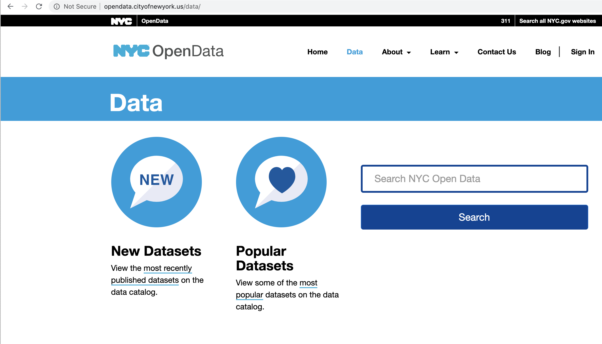
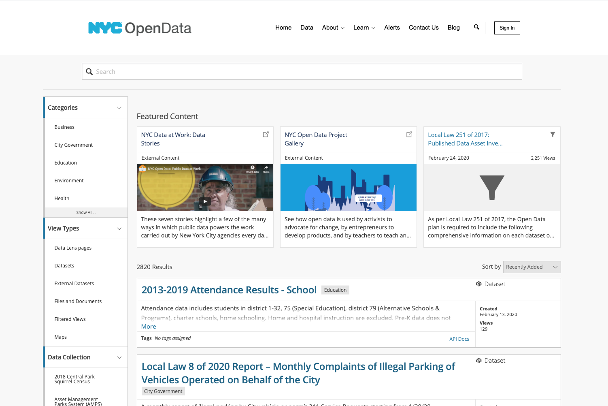

## NYC Open Data Week
## Socrata OpenData APIs

### Ori Pleban
### Data Integration Architect
### ori.pleban@tylertech.com

===

<h1>What the heck is Socrata?</h1>

---

<h2>Socrata is software to make data more useful to more people.</h2>

<!-- https://www.flickr.com/photos/hyku/2497370097 -->
---

<h2>Greater access to  data makes this universe a better places to live</h2>

---

<h2>The Socrata platform is purpose-built for governement and makes it easy for organizations to share their public data with developers</h2>

===

# So what is an API anyway?

---

  Application 
  Programming 
  Interface

---

# Common Language

A consistent way for two software systems to communicate.

---

# Stable Platform

A guarantee that the language will not change without notice.

---

# Contract

An API is a contract between a provider and a consumer.

===

# Why are APIs important?

---

## Open data is messy

<pre>
datavar 0 colorb_v
datavar 1 lum
datavar 2 absmag
datavar 3 appmag
datavar 4 texnum
datavar 5 distly
datavar 6 dcalc
datavar 7 plx
datavar 8 plxerr
datavar 9 vx
datavar 10 vy
datavar 11 vz
datavar 12 speed
datavar 13 hipnum
texturevar 4
texture -M 1 halo.sgi
    0.0000     0.0000     0.0000     0.650      0.89130      4.85    -26.72     1       0.00    0      0.000      0.00      0.000      0.000      0.000      0.000       0 # Sun
  -18.1007   143.5620  -242.6120     0.396     14.19036      1.85      9.10     1     920.90    1      3.540     39.27      0.000      0.000      0.000      0.000       1 # HIP1 HD224700 Gli
    5.0098     9.8817   -44.2976     1.038      0.31704      5.97      9.27     1     148.86    1     21.900     14.16      0.000      0.000      0.000      0.000       2 # HIP2 HD224690 Gli
 -123.2580   303.6977  -138.6362    -0.005    223.14508     -1.15      6.61     1    1160.14    1      2.810     22.42      0.000      0.000      0.000      0.000       3 # HIP3 HD224699 Gli
  -50.4801   149.0259  -112.4977     1.822      6.96657      2.62      9.05     1     630.56    1      5.170     37.72     -6.247    -32.276      9.713     34.280       8 # HIP8 HD224709 Gli
</pre>

from research.amnh.org

---

## A downloaded dataset is a stale dataset

---

## Developers don’t want to manage custom datastores

---

## You want apps to be easily portable

===

# The Socrata Open Data APIs

---

## Finding Data
 
### [opendata.cityofnewyork.us](https://opendata.cityofnewyork.us/)
 
### [www.opendatanetwork.com](https://www.opendatanetwork.com/)

---

### Open Data NYC

---
### In the Catalog

---

## API Endpoints

 
<code style='font-size:120%;'>https://$domain/resource/$identifier.$ext</code>

 

<em>Where:</em>

- <code>$domain</code> is the publisher's domain (ex: <code>data.cityofnewyork.us</code>)
- <code>$identifier</code> is a dataset's unique ID (ex: <code>tg4x-b46p</code>)
- <code>$ext</code> is <code>json</code>, <code>csv</code>, <code>xml</code>, or <code>rdf</code>

---

## Example: NYC Film Permits

<a target='blank' style='color:#FFF !important' href='https://data.cityofnewyork.us/resource/tg4x-b46p.json'><code style=''>https://data.cityofnewyork.us/resource/tg4x-b46p.json</code></a>

<pre>
  <code data-trim contenteditable class="javascript">
[
  {
    "eventid": "519983",
    "eventtype": "Shooting Permit",
    "startdatetime": "2019-11-25T06:00:00.000",
    "enddatetime": "2019-11-25T10:00:00.000",
    "enteredon": "2019-11-22T15:13:39.000",
    "eventagency": "Mayor's Office of Film, Theatre & Broadcasting",
    "parkingheld": "WEST   48 STREET between 6 AVENUE and 7 AVENUE",
    "borough": "Manhattan",
    "communityboard_s": "5",
    "policeprecinct_s": "18",
    "category": "Television",
    "subcategoryname": "News",
    "country": "United States of America",
    "zipcode_s": "10036, 10105"
  },
  {
    "eventid": "519948",
    "eventtype": "Shooting Permit",
    "startdatetime": "2019-11-25T06:00:00.000",
    "enddatetime": "2019-11-25T20:30:00.000",
    "enteredon": "2019-11-22T13:55:42.000",
    "eventagency": "Mayor's Office of Film, Theatre & Broadcasting",
    "parkingheld": "EAST   71 STREET between MADISON AVENUE and PARK AVENUE",
    "borough": "Manhattan",
    "communityboard_s": "64, 8",
    "policeprecinct_s": "19, 22",
    "category": "Film",
    "subcategoryname": "Feature",
    "country": "United States of America",
    "zipcode_s": "10021, 10023"
  },
  {
    "eventid": "519941",
    "eventtype": "Shooting Permit",
    "startdatetime": "2019-11-25T07:00:00.000",
    "enddatetime": "2019-11-25T21:00:00.000",
    "enteredon": "2019-11-22T13:40:08.000",
    "eventagency": "Mayor's Office of Film, Theatre & Broadcasting",
    "parkingheld": "BROADWAY between WEST   75 STREET and WEST   78 STREET,  BROADWAY between WEST   75 STREET and WEST   78 STREET,  5 AVENUE between EAST   79 STREET and EAST   80 STREET",
    "borough": "Manhattan",
    "communityboard_s": "64, 7, 8",
    "policeprecinct_s": "19, 20, 22",
    "category": "Film",
    "subcategoryname": "Feature",
    "country": "United States of America",
    "zipcode_s": "10023, 10024, 10075"
  },
  {
    "eventid": "519916",
    "eventtype": "Shooting Permit",
    "startdatetime": "2019-11-25T06:00:00.000",
    "enddatetime": "2019-11-25T22:00:00.000",
    "enteredon": "2019-11-22T12:41:05.000",
    "eventagency": "Mayor's Office of Film, Theatre & Broadcasting",
    "parkingheld": "ATLANTIC AVENUE between COURT STREET and HENRY STREET,  COURT STREET between MONTAGUE STREET and JORALEMON STREET,  WASHINGTON PARK between MYRTLE AVENUE and DEKALB AVENUE,  DEKALB AVENUE between ASHLAND PLACE and WASHINGTON PARK,  ADELPHI STREET between GREENE AVENUE and LAFAYETTE AVENUE,  LAFAYETTE AVENUE between CARLTON AVENUE and CUMBERLAND STREET,  LAFAYETTE AVENUE between CARLTON AVENUE and ADELPHI STREET",
    "borough": "Brooklyn",
    "communityboard_s": "2, 6",
    "policeprecinct_s": "76, 84, 88",
    "category": "Television",
    "subcategoryname": "Episodic series",
    "country": "United States of America",
    "zipcode_s": "11201, 11205, 11217, 11238"
  },
  {
    "eventid": "519904",
    "eventtype": "Shooting Permit",
    "startdatetime": "2019-11-23T06:00:00.000",
    "enddatetime": "2019-11-23T20:00:00.000",
    "enteredon": "2019-11-22T11:57:36.000",
    "eventagency": "Mayor's Office of Film, Theatre & Broadcasting",
    "parkingheld": "BARROW STREET between BEDFORD STREET and 7 AVENUE SOUTH,  7 AVENUE SOUTH between BARROW STREET and COMMERCE STREET",
    "borough": "Manhattan",
    "communityboard_s": "2",
    "policeprecinct_s": "6",
    "category": "Film",
    "subcategoryname": "Feature",
    "country": "United States of America",
    "zipcode_s": "10014"
  },... and so on
]
  </code>
</pre>

---

## Simple Filters

<a target='blank' style='color:#FFF !important' href='https://data.cityofnewyork.us/resource/tg4x-b46p.json?category=Television'><code style=''>https://data.cityofnewyork.us/resource/tg4x-b46p.json
 ?category=Television</code></a>

<pre><code data-trim contenteditable class="javascript">
[
  {
    "eventid": "519636",
    "eventtype": "Shooting Permit",
    "startdatetime": "2019-11-25T09:00:00.000",
    "enddatetime": "2019-11-26T00:00:00.000",
    "enteredon": "2019-11-21T11:20:51.000",
    "eventagency": "Mayor's Office of Film, Theatre & Broadcasting",
    "parkingheld": "34 AVENUE between 36 STREET and 35 STREET,  35 STREET between 34 AVENUE and 35 AVENUE,  35 STREET between ASTORIA BOULEVARD and 28 AVENUE,  28 AVENUE between 35 STREET and 34 STREET,  35 STREET between 28 AVENUE and 30 AVENUE,  28 AVENUE between 33 STREET and 34 STREET",
    "borough": "Queens",
    "communityboard_s": "1",
    "policeprecinct_s": "114",
    "category": "Television",
    "subcategoryname": "Cable-episodic",
    "country": "United States of America",
    "zipcode_s": "11103, 11106"
  },
  {
    "eventid": "516485",
    "eventtype": "Shooting Permit",
    "startdatetime": "2019-11-25T07:00:00.000",
    "enddatetime": "2019-11-25T23:00:00.000",
    "enteredon": "2019-11-12T17:12:27.000",
    "eventagency": "Mayor's Office of Film, Theatre & Broadcasting",
    "parkingheld": "MOSHOLU AVENUE between WEST  256 STREET and WEST  254 STREET,  RIVERDALE AVENUE between WEST  256 STREET and WEST  258 STREET,  RIVERDALE AVENUE between WEST  258 STREET and WEST  260 STREET",
    "borough": "Bronx",
    "communityboard_s": "8",
    "policeprecinct_s": "50",
    "category": "Television",
    "subcategoryname": "Episodic series",
    "country": "United States of America",
    "zipcode_s": "10471"
  },
  {
    "eventid": "519527",
    "eventtype": "Shooting Permit",
    "startdatetime": "2019-11-25T06:00:00.000",
    "enddatetime": "2019-11-26T00:00:00.000",
    "enteredon": "2019-11-20T16:43:16.000",
    "eventagency": "Mayor's Office of Film, Theatre & Broadcasting",
    "parkingheld": "PARK AVENUE SOUTH between EAST   21 STREET and EAST   18 STREET,  EAST   20 STREET between PARK AVENUE SOUTH and 3 AVENUE,  EAST   19 STREET between PARK AVENUE SOUTH and 3 AVENUE,  IRVING PLACE between EAST   20 STREET and EAST   17 STREET",
    "borough": "Manhattan",
    "communityboard_s": "5, 6",
    "policeprecinct_s": "13",
    "category": "Television",
    "subcategoryname": "Episodic series",
    "country": "United States of America",
    "zipcode_s": "10003, 10010"
  },
  {
    "eventid": "519453",
    "eventtype": "Shooting Permit",
    "startdatetime": "2019-11-25T06:00:00.000",
    "enddatetime": "2019-11-25T22:00:00.000",
    "enteredon": "2019-11-20T14:34:41.000",
    "eventagency": "Mayor's Office of Film, Theatre & Broadcasting",
    "parkingheld": "PARK AVENUE between EAST   70 STREET and EAST   71 STREET,  PARK AVENUE between EAST   70 STREET and EAST   69 STREET,  EAST   69 STREET between PARK AVENUE and MADISON AVENUE,  PARK AVENUE between EAST   69 STREET and EAST   68 STREET,  PARK AVENUE between EAST   68 STREET and EAST   67 STREET,  EAST   68 STREET between PARK AVENUE and MADISON AVENUE,  MADISON AVENUE between EAST   67 STREET and EAST   68 STREET,  MADISON AVENUE between EAST   68 STREET and EAST   69 STREET,  MADISON AVENUE between EAST   69 STREET and EAST   70 STREET,  37 STREET between 43 AVENUE and SKILLMAN AVENUE,  38 STREET between 43 AVENUE and SKILLMAN AVENUE,  43 AVENUE between 39 STREET and 37 STREET,  37 STREET between QUEENS BOULEVARD and 43 AVENUE,  QUEENS BOULEVARD between 37 STREET and 38 STREET",
    "borough": "Manhattan",
    "communityboard_s": "2, 8",
    "policeprecinct_s": "108, 19",
    "category": "Television",
    "subcategoryname": "Episodic series",
    "country": "United States of America",
    "zipcode_s": "10021, 10065, 11101"
  }, ... // and so on
]
</code></pre>

---

## SoQL Queries
<a href="https://data.cityofnewyork.us/resource/tg4x-b46p.json?$select=eventid,category, subcategoryname,borough&$where=startdatetime >='2019-01-01' AND borough ='Queens'"><code>https://data.cityofnewyork.us/resource/tg4x-b46p.json?$WHERE=startdatetime &gte; '2019-01-01' AND borough ='Queens'</code></a>

<pre><code data-trim contenteditable class="javascript">
  [
    {
      "eventid": "496377",
      "category": "Television",
      "subcategoryname": "Episodic series",
      "borough": "Queens"
    },
    {
      "eventid": "496675",
      "category": "Television",
      "subcategoryname": "Episodic series",
      "borough": "Queens"
    },
    {
      "eventid": "497090",
      "category": "Television",
      "subcategoryname": "Cable-other",
      "borough": "Queens"
    },
    {
      "eventid": "498138",
      "category": "Film",
      "subcategoryname": "Feature",
      "borough": "Queens"
    },
    {
      "eventid": "505645",
      "category": "Television",
      "subcategoryname": "Episodic series",
      "borough": "Queens"
    },
    {
      "eventid": "507446",
      "category": "Television",
      "subcategoryname": "Episodic series",
      "borough": "Queens"
    },..., and so on
  ]
</code></pre>
<small style="padding-top: 5em">For more details see <a href="http://dev.socrata.com">dev.socrata.com</a></small>

---

## SoQL Clauses

<table class="table table-striped table-hover">
  <thead>
    <tr>
      <th>Parameter</th>
      <th>Description</th>
      <th>Default</th>
      <th>In <code class="highlighter-rouge">$query</code></th>
    </tr>
  </thead>
  <tbody>
    <tr>
      <td><a href="/docs/queries/select.html"><code class="highlighter-rouge">$select</code></a></td>
      <td>The set of columns to be returned, similar to a <code class="highlighter-rouge">SELECT</code> in SQL</td>
      <td>All columns, equivalent to <code class="highlighter-rouge">$select=*</code></td>
      <td><code class="highlighter-rouge">SELECT</code></td>
    </tr>
    <tr>
      <td><a href="/docs/queries/where.html"><code class="highlighter-rouge">$where</code></a></td>
      <td>Filters the rows to be returned, similar to <code class="highlighter-rouge">WHERE</code></td>
      <td>No filter</td>
      <td><code class="highlighter-rouge">WHERE</code></td>
    </tr>
    <tr>
      <td><a href="/docs/queries/order.html"><code class="highlighter-rouge">$order</code></a></td>
      <td>Column to order results on, similar to ORDER BY in SQL</td>
      <td>Unspecified order</td>
      <td><code class="highlighter-rouge">ORDER BY</code></td>
    </tr>
    <tr>
      <td><a href="/docs/queries/group.html"><code class="highlighter-rouge">$group</code></a></td>
      <td>Column to group results on, similar to GROUP BY in SQL</td>
      <td>No grouping</td>
      <td><code class="highlighter-rouge">GROUP BY</code></td>
    </tr>
    <tr>
      <td><a href="/docs/queries/having.html"><code class="highlighter-rouge">$having</code></a></td>
      <td>Filters the rows that result from an aggregation, similar to <code class="highlighter-rouge">HAVING</code></td>
      <td>No filter</td>
      <td><code class="highlighter-rouge">HAVING</code></td>
    </tr>
    <tr>
      <td><a href="/docs/queries/limit.html"><code class="highlighter-rouge">$limit</code></a></td>
      <td>Maximum number of results to return</td>
      <td>1000 (2.0 endpoints: maximum of 50,000; 2.1: unlimited <a href="/docs/endpoints.html">»</a>)</td>
      <td><code class="highlighter-rouge">LIMIT</code></td>
    </tr>
    <tr>
      <td><a href="/docs/queries/offset.html"><code class="highlighter-rouge">$offset</code></a></td>
      <td>Offset count into the results to start at, used for paging</td>
      <td>0</td>
      <td><code class="highlighter-rouge">OFFSET</code></td>
    </tr>
    <tr>
      <td><a href="/docs/queries/q.html"><code class="highlighter-rouge">$q</code></a></td>
      <td>Performs a full text search for a value.</td>
      <td>No search</td>
      <td><code class="highlighter-rouge">N/A</code></td>
    </tr>
    <tr>
      <td><a href="/docs/queries/query.html"><code class="highlighter-rouge">$query</code></a></td>
      <td>A full SoQL query string, all as one parameter</td>
      <td>N/A</td>
      <td><code class="highlighter-rouge">N/A</code></td>
    </tr>
  </tbody>
</table>

---

## Aggregating Data

<a href="https://data.cityofnewyork.us/resource/tg4x-b46p.json?$select=borough, count(*) as number_of_permits&$group=borough&$where=startdatetime >='2019-01-01'">
  <code>https://data.cityofnewyork.us/resource/tg4x-b46p.json?
    $SELECT=
    borough, count(*) as number_of_permits
    $WHERE=
    startdatetime &gte; '2019-01-01'
  </code>
</a>

<pre><code data-trim contenteditable class="javascript">
  [
    {
      "borough": "Brooklyn",
      "number_of_permits": "2365"
    },
      {
      "borough": "Manhattan",
      "number_of_permits": "3586"
    },
    {
      "borough": "Queens",
      "number_of_permits": "1336"
    },
    {
      "borough": "Bronx",
      "number_of_permits": "246"
    },
    {
      "borough": "Staten Island",
      "number_of_permits": "170"
    }
  ]
</code></pre>

---

## Geospatial Queries
  <a target='blank' style='color:#FFF !important' href='data.cityofnewyork.us/resource/x3ar-yjn2?$where=within_circle(the_geom,40.662481, -73.969150,1000)'><code style=''>https://data.cityofnewyork.us/resource/x3ar-yjn2.json
   ?$where=within_circle(the_geom,40.662, -73.969,1000)</code></a>

  <pre><code data-trim contenteditable class="javascript">
  [{
    "bin": "3025689",
    "objectid": "15",
    "the_geom": {
      "type": "MultiPolygon",
      "coordinates": [
        [
          [
            [
              -73.97605642393026,
              40.666638336470896
            ],
            [
              -73.97615023072676,
              40.66652645245729
            ],
            [
              -73.97617037938288,
              40.666502420964584
            ],
            [
              -73.97617274563603,
              40.666499599238065
            ],
            [
              -73.97617574306379,
              40.66650105689349
            ],
            [
              -73.97620225995925,
              40.666513946962624
            ],...
          ]
        ]
      ]
    },
    "bbl": "3010870032",
    "doitt_id": "302860",
    "height_roo": "45.32",
    "ground_ele": "155",
    "borough": "BK",
    "block": "1087",
    "lot": "32",
    "zip_code": "11215",
    "address": "618 6 STREET",
    "owner_name": "DONALD KNUTSON",
    "num_floors": "3",
    "year_built": "1920",
    "year_alter_1": "0",
    "year_alter_2": "0",
    "des_addres": "618 6th Street"
  },
  {
    "bin": "3025647",
    "objectid": "26",
    "the_geom": {
      "type": "MultiPolygon",
      "coordinates": [
        [
          [
            [
              -73.97542926349496,
              40.66681862437225
            ],
            [
              -73.97537223783446,
              40.666791177063786
            ],
            [
              -73.97528024344004,
              40.66674689878175
            ],
            [
              -73.97532060320022,
              40.666698279593234
            ],
            [
              -73.97542187598211,
              40.66674702368282
            ],
            [
              -73.97556113531485,
              40.66681405082677
            ],
            [
              -73.9755644659575,
              40.666825976164596
            ], ...
          ]
        ]
      ]
    },
    "bbl": "3010850043",
    "doitt_id": "348423",
    "height_roo": "57.05",
    "ground_ele": "156",
    "borough": "BK",
    "block": "1085",
    "lot": "43",
    "zip_code": "11215",
    "address": "104 PROSPECT PARK WEST",
    "owner_name": "KINDIG, ERINN",
    "num_floors": "4",
    "year_built": "1901",
    "year_alter_1": "0",
    "year_alter_2": "0",
    "des_addres": "104 Prospect Park West"
  }, ...]
  </code></pre>

---
## Paging Through Data

<a target='_blank' style='color:#FFF !important' href='https://data.cityofnewyork.us/resource/tg4x-b46p.json?$limit=50&$offset=100'><code style=''>https://data.cityofnewyork.us/resource/tg4x-b46p.json
 ?$limit=50&$offset=100</code></a>

---

## SoQL Function Listing

<a target='_blank' style='color:#FFF !important' href='https://dev.socrata.com/docs/functions/'>

---

## Application Tokens

1. Register at [https:/data.cityofnewyork.us/profile/app_tokens](https://data.cityofnewyork.us/profile/app_tokens)
2. Include as:
  - <code>X-App-Token: $token</code> HTTP Header or ...
  - The <code>$$app_token=$token</code> URL parameter
3. Profit!!! (from more API requests)

===

# Help!

---

## Developer Portal

# [dev.socrata.com](http://dev.socrata.com)

Community powered! Learn how to <a href="http://dev.socrata.com/contributing.html">contribute</a>.

---

## Getting Help

- Stack Overflow: [soda](http://stackoverflow.com/questions/tagged/soda) or [socrata](http://stackoverflow.com/questions/tagged/socrata)

---

## Libraries &amp; SDKs

### [dev.socrata.com/libraries/](http://dev.socrata.com/libraries/)

<a href="http://socrata.github.io/soda-ruby/">Ruby</a>, <a href="https://github.com/socrata/soda-scala">Scala</a>, <a href="http://socrata.github.io/soda-java/">Java</a>, <a href="https://github.com/socrata/soda-ios-sdk">ObjectiveC</a>, <a href="https://github.com/Chicago/RSocrata">R</a>, <a href="https://github.com/socrata/soda-swift">Swift</a>, etc.

===

# Thanks!
